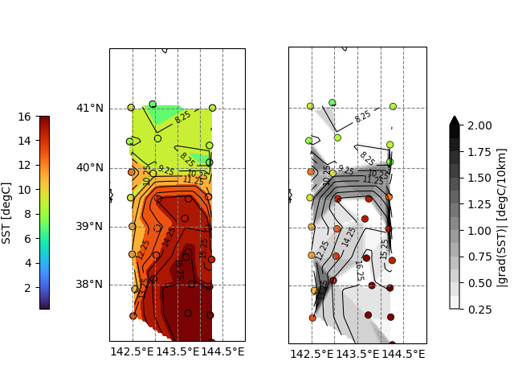

# visualize_bucket_sampling
バケツ採水SST可視化ツール。  
観測点ごとのバケツ採水によるSSTデータをbilinear補間し、SST場とSSTの勾配(の絶対値)を求める。
  
<p align="center">

</p>
(左図)散布図: 観測されたSST、等値線、陰影: 補間されたSST (右図)散布図: 観測されたSST、等値線:補間されたSST、陰影:補間されたSSTの勾配の絶対値  

## Dependencies
- numpy
- pandas
- scipy
- metpy
- matplotlib
- cartopy

## Usage
### 0. 可視化用データファイル作成  
各観測点の
- 観測点名
- 経度
- 緯度
- 海面水温  
をまとめたCSVファイルを作成する。 

(例)
```
STname,lon,lat,sst
P01,140.10,33.50,22.24
```
### 1. namelist.pyを編集
```
# plot area [lon_min,lon_max,lat_min,lat_max]
plot_area = [142, 145, 37, 42]

# interpolation
lon = np.arange(141, 146, 0.05)
lat = np.arange(36, 43, 0.05)
lon2d, lat2d = np.meshgrid(lon, lat)

# SST colorbar
sst_min = 5.0
sst_max = 16.0
sst_delta = 1.0

# norm of grad of SST colorbar
grad_min = 0.25
grad_max = 2.0
grad_delta = 0.125
```
### 2. run ```plot_sst_interp_grad.py```

## Author
Sou Tomita  
